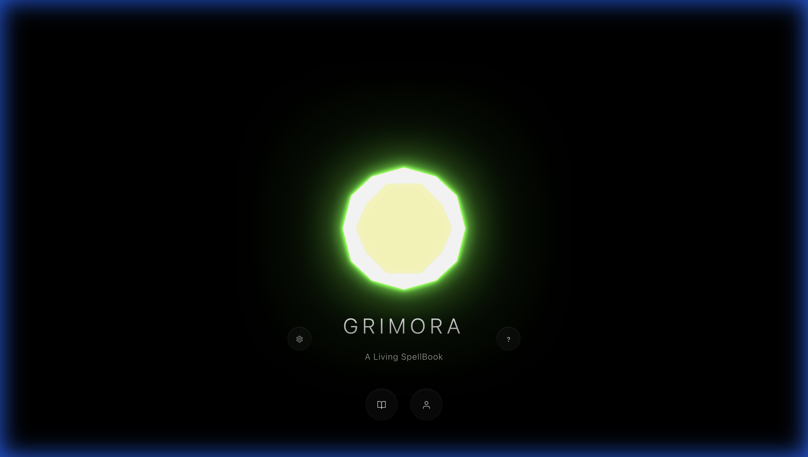
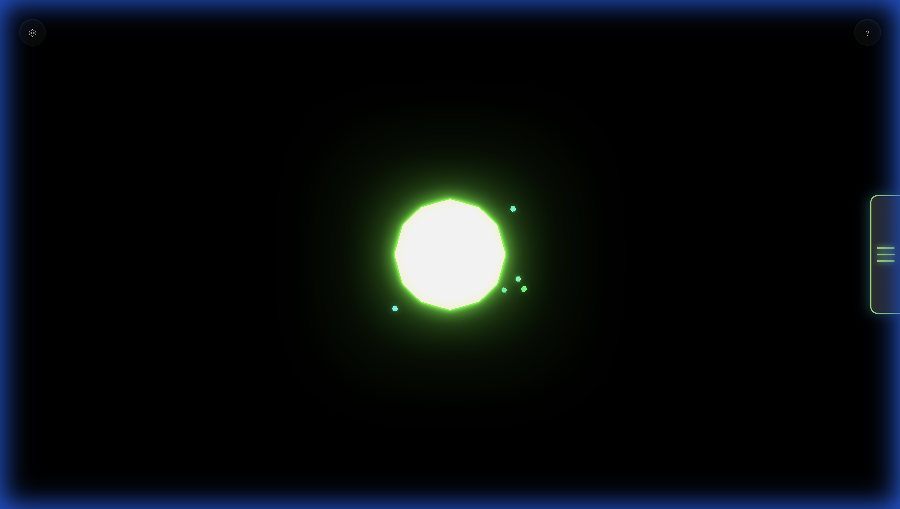
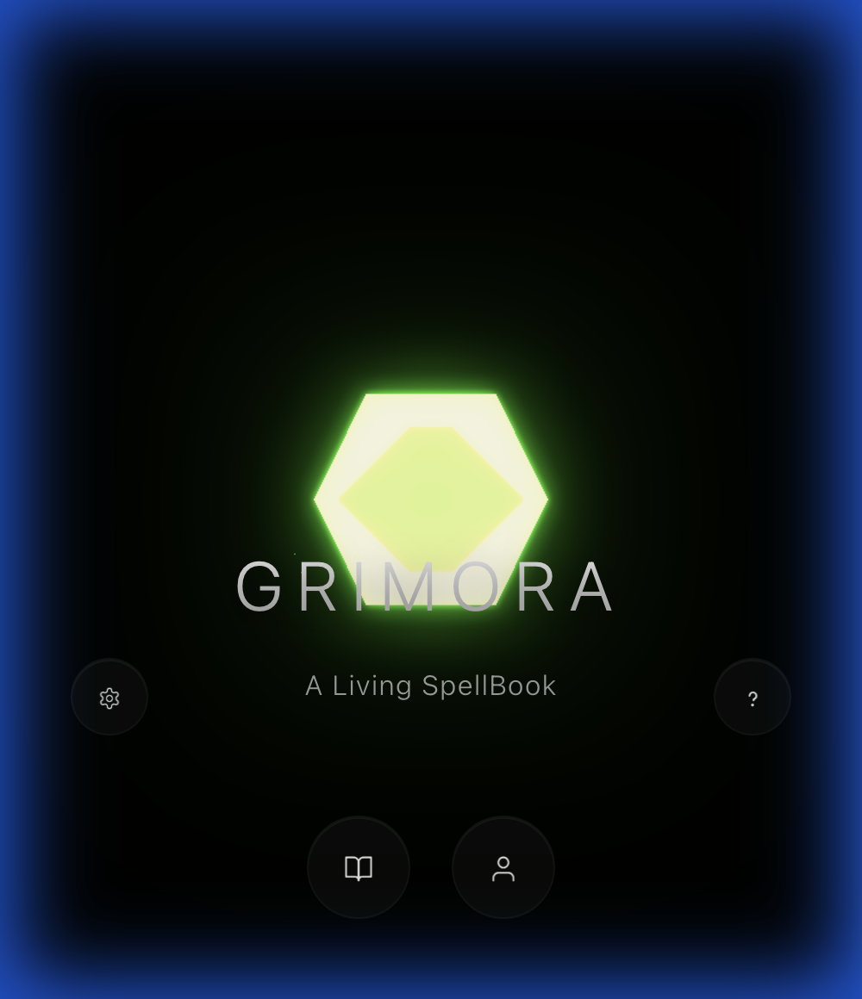
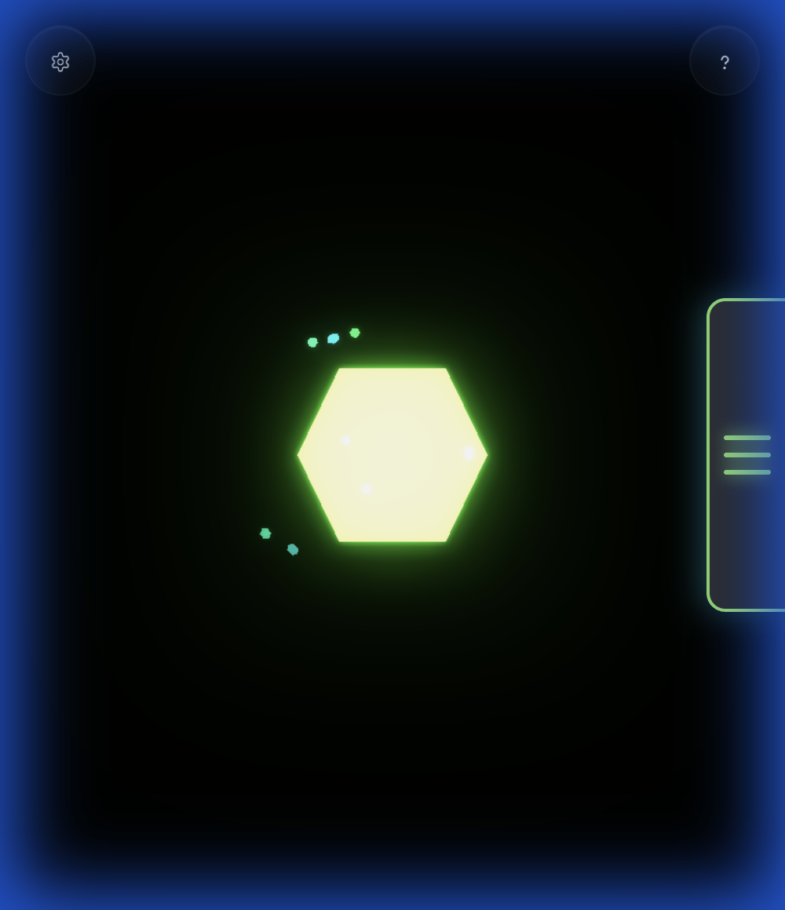

# Grimora

> *A living spellbook, as your companion*

**Grimora** is a digital grimoire—a structured learning companion for students of the **KemKnightRanger Academy (KRA)**. It weaves together mathematics, chemistry, physics, and engineering with the historical and philosophical roots of science in African alchemy (Khemia/Kimia) and the principle of Ma'at (balance, truth, and order).

---

## 🌟 Vision

Grimora transforms STEM education into an immersive journey where:
- **Mathematics** becomes symbolic "spells" of quantity and pattern
- **Chemistry** reveals the transformation of matter
- **Physics & Engineering** demonstrate applied motion, force, and design
- **Khemia/Alchemy lore** provides historical and philosophical context

This is not a gamified point-chasing app—it's a **living spellbook** that helps learners bring order to chaos and create with awareness, discipline, and curiosity.

---

## 📸 Screenshots

### Desktop View

<table>
<tr>
<td width="50%">

**Cover Screen**



</td>
<td width="50%">

**Hub/Main View**



</td>
</tr>
</table>

### Mobile View

<table>
<tr>
<td width="50%">

**Cover Screen**



</td>
<td width="50%">

**Hub/Main View**



</td>
</tr>
</table>

---

## 🎯 Target Audience

**Age Range:** 13+ (8th grade through adult re-learners)

**Reading Level:** 7th–10th grade, with optional deeper study notes

**Personas:**

- **Young Initiates (13-16):** Curious students who want science to feel alive and meaningful
- **Returning Learners (17+):** Adults re-learning foundational concepts with renewed purpose
- **Guides/Mentors:** Teachers, parents, and tutors supporting learners

---

## 📚 Level 1: Initiate Chapter

### Four Halls of Grimora

**Level 1** introduces core foundations through four thematic "Halls":

#### 1. **Math Sanctum** 🔢

**Operations as Transformations**

- Addition ↔ Subtraction as opposite transformations
- Multiplication ↔ Division as scaling & unscaling
- Exponents ↔ Roots as "powering up" & "revealing the seed"

#### 2. **Matter Lab** ⚗️

**Matter & Elements**

- Understanding matter, mass, and volume
- States of matter (solid, liquid, gas, plasma)
- Atoms, molecules, and the periodic table

#### 3. **Hall of Ma'at** ⚖️

**Balance, Truth & Clear Thinking**

- Ma'at as a principle of balance and order
- The Trivium (Grammar, Logic, Rhetoric) in scientific thinking
- From Khemia to Chemistry: historical evolution

#### 4. **Machina Workshop** ⚙️

**Forces & Simple Machines**

- Understanding forces as pushes and pulls
- Balance vs. imbalance in physical systems
- Simple machines (lever, ramp, pulley, wheel)

---

## 🏗️ Project Structure

```text
Grimora/
├── package.json              # npm dependencies and scripts
├── vite.config.js            # Vite + Vitest configuration
│
├── client/                    # Front-end application (Vite root)
│   ├── index.html            # Entry point
│   ├── CSS/                  # Stylesheets
│   ├── JS/
│   │   ├── app/              # Application orchestration
│   │   ├── __tests__/        # Vitest unit tests
│   │   ├── three/            # THREE.js scenes, views, components
│   │   └── data/             # Lesson metadata, tracks, halls, paths
│   └── public/               # Static assets (copied as-is to dist/)
│       └── assets/           # Images, icons, 3D models, SVGs
│
├── Content/                   # Lesson content (Markdown)
│   └── Grimora_Level1/
│       ├── Math_Sanctum/
│       ├── Matter_Lab/
│       ├── Hall_of_Maat/
│       └── Machina_Workshop/
│
├── Primers/                   # Design documents & templates
│   ├── A_Primers/            # Project vision, UX flows, charters
│   └── Templates/            # Lesson templates by subject
│
└── References/                # Reference materials (PDFs, etc.)
```

---

## 🛠️ Technology Stack

**Front-End Only (Phase 1):**

- **HTML5** - Semantic structure
- **CSS3** - Styling and layout with backdrop-filter effects
- **Vanilla JavaScript (ES6+)** - No frameworks, modular architecture
- **THREE.js** - 3D visualization and animation
- **Vite** - Dev server with HMR and optimized production builds
- **Vitest** - Unit testing with jsdom environment
- **JSDoc** - Comprehensive documentation
- **JSON/JS modules** - Content and configuration data

### 3D Visualization

- **Dual Canvas Architecture** - Separate THREE.js scenes for background and side panel
- **Raycasting for Interaction** - Mouse hover detection on 3D objects
- **WebGL Rendering** - Hardware-accelerated graphics with fallback support
- **Optimization** - Device pixel ratio scaling and viewport constraints

### Architecture Principles

**Separation of Concerns:**

- `core/` - Pure functions (no DOM, no side effects)
- `ui/` - DOM rendering and event handling
- `app/` - Orchestration and coordination
- `data/` - Content definitions and metadata

**Clean Code Practices:**

- Single Responsibility Principle
- Domain-Driven Design concepts
- Comprehensive JSDoc annotations

---

## 🚀 Getting Started

### Prerequisites

- **Node.js 18+** — [nodejs.org](https://nodejs.org)

### Running Locally

Clone the repository and install dependencies:

```bash
git clone https://github.com/Olu-AnuAkin-Akinyemi/Grimora.git
cd Grimora
npm install
```

Start the Vite dev server:

```bash
npm run dev
# Opens http://localhost:5173 automatically
```

### Other Commands

```bash
npm run build        # Production build → dist/
npm run preview      # Preview the production build locally
npm test             # Run tests in watch mode
npm run test:run     # Run tests once (CI-friendly)
npm run test:coverage  # Generate coverage report
```

### Development Notes

- Vite provides instant HMR — changes reflect in the browser without a manual refresh
- THREE.js visualizations require WebGL support
- Open browser DevTools (F12) to debug and check for console errors
- Tests live in `client/JS/__tests__/` and run with Vitest + jsdom

---

## 📖 Content Structure

Each lesson follows a consistent template:

- **Lesson Snapshot** - ID, objectives, key terms, estimated time
- **Narrative Hook** - Story or scenario to engage curiosity
- **Core Concepts** - Main teaching content with examples
- **Worked Examples** - Step-by-step demonstrations
- **Practice Exercises** - Hands-on application
- **Reflection Prompts** - Deeper thinking and connections
- **Deeper Study Notes** - Optional advanced content (collapsible)

### Lesson Metadata

Lessons are tracked in `client/JS/data/lessons_level1.js` with:

- Unique IDs for routing and state management
- Track/Hall associations
- Learning paths (Mind, Matter, Motion, Heart, Code & Flow)
- Cross-lesson connections
- Estimated completion times

---

## 🎭 UI/UX Features

### Three-Tier Navigation

1. **Cover State** - Opening screen with 3D orb animation and the title "Grimora: A Living SpellBook"
2. **Main View** - Animated background sigil with book spine button
3. **Side Panel** - Clean, minimalist panel with four Hall sigils and interactive hover detection

### Interactive Elements

- **Hall Sigils** - 3D rotating/floating spheres representing each Hall
  - **Math Sanctum** - Orange sigil with cyan glow
  - **Matter Lab** - Cyan sigil with pulse animation
  - **Hall of Ma'at** - Yellow/gold sigil with steady glow
  - **Machina Workshop** - Green sigil with rotating motion

- **Hover Tooltips** - Liquid Glass design with enhanced blur revealing:
  - Hall name and subtitle
  - Associated learning paths (Mind, Matter, Motion, Heart, Code & Flow)
  - Quick navigation hint
  - Subtle gradient overlay and edge lensing for premium feel

- **Pointer Feedback** - Cursor changes to pointer only when hovering over interactive sigils
- **Help Icon** - Displays a tooltip and opens an information panel with guidance on using the app.

### Design Details

- **Liquid Glass Effect** - Apple-inspired optical glass aesthetic featuring:
  - Enhanced refraction with 40-80px blur and 180% saturation
  - Multi-layer backgrounds with subtle gradient overlays
  - Edge lensing via layered box-shadows and inset highlights
  - Soft borders with semi-transparent cyan accents
  - Fluid cubic-bezier easing (0.4, 0, 0.2, 1) for natural motion
- **Smooth Animations** - requestAnimationFrame-based rendering for 60fps performance
- **Responsive Layout** - Flexbox-based panel that adapts to screen size
- **Mobile-First** - Touch-friendly interactions with appropriate spacing

---

## 🎨 Design Philosophy

### The Trivium in Learning

- **Grammar** - Names, symbols, and vocabulary
- **Logic** - Structure of reasoning and relationships
- **Rhetoric** - Clear expression and explanation

### Ma'at as Metaphor

Balance, truth, and order inform:

- Equation balance in mathematics
- Conservation laws in chemistry
- Force equilibrium in physics
- Responsible creation in engineering

### Optional Depth

- Core content accessible at 7th-10th grade level
- Advanced concepts available via "Deeper Study" sections
- Clearly marked as enrichment, never required

---

## 🗺️ Roadmap

### Current Status: Level 1 (Initiate)

✅ Content structure defined  
✅ Lesson templates created  
✅ Initial lessons drafted  
✅ UI/UX implementation with THREE.js visualization  
✅ Interactive Hall sigils with hover detection  
✅ Responsive side panel navigation  
✅ Vite dev server + Vitest unit testing  
🔄 Lesson page routing and content display in progress

### Future Levels

- **Level 2 (Apprentice):** Deeper chemical reactions, algebraic thinking, compound machines
- **Level 3 (Journeyman):** Stoichiometry, functions, energy systems
- **Level 4+:** Engineering applications (chemical, mechanical, electrical, robotics)

---

## 🤝 Contributing

This project is in active development. Contributions welcome in:

- Content review and editing
- UI/UX design
- JavaScript implementation
- Accessibility improvements
- Lesson creation

Please review the primers in `/Primers/A_Primers/` before contributing to understand the project philosophy.

---

## 📜 License

[License information to be added]

---

## 🙏 Acknowledgments

**Grimora** draws inspiration from:

- Kemetic (ancient Egyptian) wisdom and Ma'at philosophy
- Historical alchemy and Khemia traditions
- The classical Trivium and Quadrivium
- Modern STEM education best practices
- "Holistic"-centered approaches to science and mathematics

---

## 📞 Contact

**Repository:** [github.com/Olu-AnuAkin-Akinyemi/Grimora](https://github.com/Olu-AnuAkin-Akinyemi/Grimora)
**Email:** olutakinyemi@gmail.com

---

> *"Science is the modern form of alchemy—the art of transformation guided by truth and balance."*
